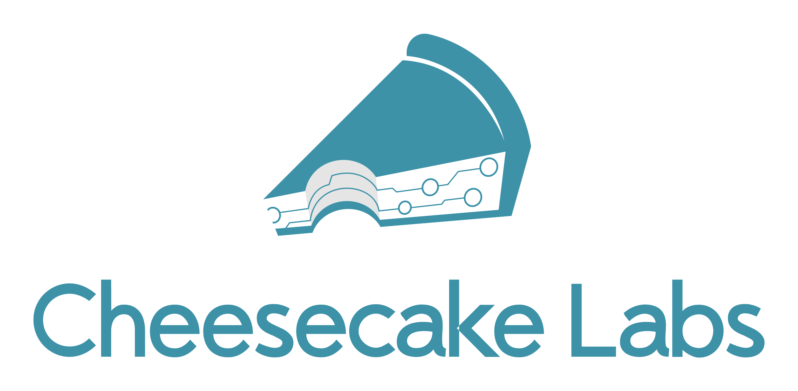

# Cruncher aka Scrapery =)
===================
Cruncher is an application that crawls over [TechCrunch](https://techcrunch.com) informations about posts, stores data about authors, articles and provides a web API to consume it.

Why? This is a challenge for [Cheesecake Labs](https://ckl.io). Because I love this company and I need this job :)

### Considerations
This is my first real project with Django and Django REST Framework, including applying DevOps during the process. I tried to follow the recommendations and best practices available on the Internet and the documentations. Here are some considerations:

- I need improve the front-end.
- Digital Ocean is a big jerk sometimes, but work as well.
- Improve production deployment. It's my first time with DO.
- Write more tests.
- Collect more data with the crawler.

### API Endpoint
The production API endpoint can be consumed at `cruncher.oclubecast.com/api/v1/`.

Here are the GETs:
- `/api/v1/authors/`: get all the authors paginated.
- `/api/v1/authors/<id>`: get details on one author.
- `/api/v1/articles/`: get all the articles paginated.
- `/api/v1/articles/<id>`: get details on one article.

### Softwares used
Here's a list of softwares, libraries and servicesused in this project:
- Digital Ocean
- Docker
- docker-compose
- NGINX
- Django
- Django REST Framework
- Gunicorn
- coverage
- PostgreSQL
- psycopg2
- Scrapy

### Up and running: local!
As Freddie Mercury used to say... "It's so eaaaasy" - Understanders will understand. But you need a Docker and Docker-Compose installed.

Repository clone:
```bash
git clone https://github.com/perylemke/cruncher
cd cruncher
```
Run docker-compose to build and migrate Django models:
```bash
docker-compose build
docker-compose up -d
docker-compose run web python manage.py makemigrations
docker-compose run web python manage.py migrate
```
Run the crawler (here with 100 requests limit):
```bash
docker-compose run scrap scrapy crawl cruncher --set CLOSESPIDER_PAGECOUNT=100
```
You're ready to go! Consume the API at `http://localhost:8000/api/v1/`.

# Run in production

Access the URL - http://cruncher.oclubecast.com.br/api/v1/

### Thanks!
